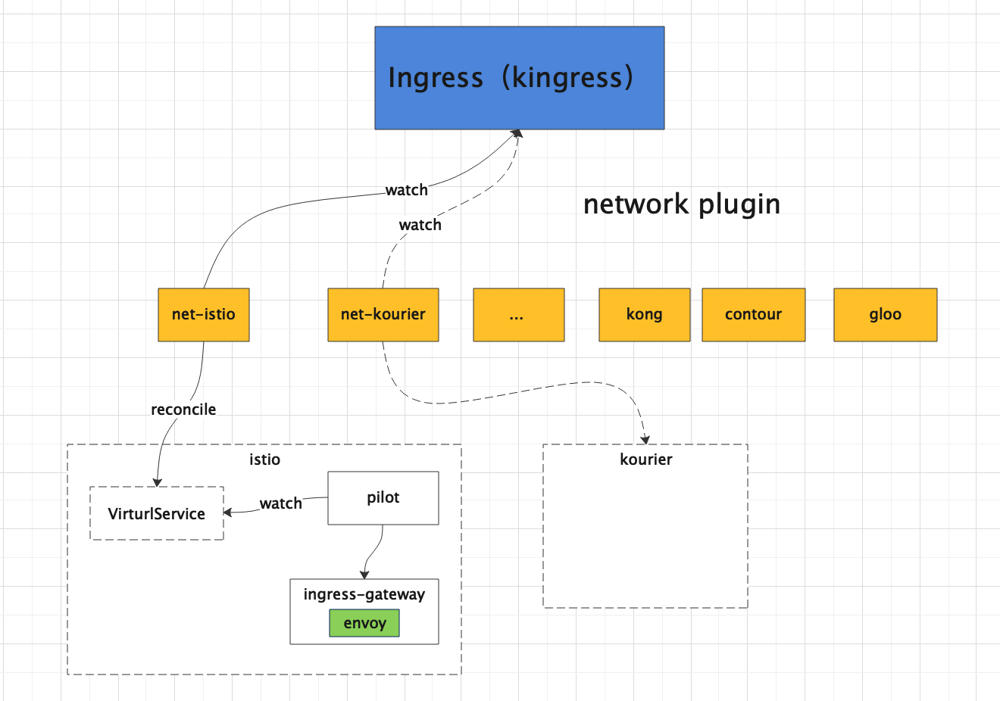

# 如何基于 Knative 开发 自定义controller

## 1. 为什么要开发 自定义 controller？

开源版本的 `Knative` 提供了扩缩容及事件驱动的架构，对于大部分场景的 `Serverless` 已经满足了，不过对于商业版本的 `Serverless` 平台来说，免不了要添加一些增强特性。

通常情况下，`In-Tree` 形式的增强不推荐，而且这种方式也会因开源版本升级带来不小的适配工作量。

`Out-Of-Tree` 形式的 自定义 `controller` 是一种很好特性增强方式，而且社区本身对于周边组件的解耦也是通过 controller 来对接的。比如：

* \*\*\*\*[**net-contour**](https://github.com/knative-sandbox/net-contour) **: 对接  Contour 七层负载的网络插件**
* \*\*\*\*[**net-kourier**](https://github.com/knative-sandbox/net-kourier) **: 对接  Kourier 七层负载的网络插件**
* \*\*\*\*[**net-istio**](https://github.com/knative-sandbox/net-istio) **: 对接  Istio 七层负载的网络插件**

> 上述提到的几个网络插件都是通过 自定义 `Controller` 结合  `Kingress` 这个 `CRD`资源来实现



## 2. How？

对于 有过 `Kubernetes` `operator` 开发经验的同学来说，可能对 [**Kubebuilder**](https://cloudnative.to/kubebuilder/introduction.html) ****更熟悉一些，其实 `Knative` 自定义 控制器的开发更简单，下面一步一步介绍怎么开始

### 2.1  Fork 社区 Template

社区 项目地址在  [https://github.com/knative-sandbox/sample-controller](https://github.com/knative-sandbox/sample-controller)，直接 fork 到个人仓库。

### 2.2 sample-controller介绍

代码下载到本地,目录如下，如下（此处省略掉不重要的文件）：

```bash
sample-controller
├── cmd
│   ├── controller 
│   │   └── main.go # controller 的启动入口文件
│   ├── schema
│   │   └── main.go # 生成 CRD 资源的 工具
│   └── webhook
│       └── main.go # webhook 的入口文件
├── config # controller 和webhook 的部署文件（deploy role clusterrole 等等，此处省略）
│   ├── 300-addressableservice.yaml
│   ├── 300-simpledeployment.yaml
├── example-addressable-service.yaml # CR 资源的示例yaml
├── example-simple-deployment.yaml # CR 资源的示例yaml
├── hack
│   ├── update-codegen.sh # 生成 informer，clientset，injection，lister 等
│   ├── update-deps.sh
│   ├── update-k8s-deps.sh
│   └── verify-codegen.sh
├── pkg
│   ├── apis
│   │   └── samples 
│   │       ├── register.go
│   │       └── v1alpha1 # 此处需编写 CRD 资源的types
│   ├── client # 执行 hack/update-codegen.sh 后自动生成的文件
│   │   ├── clientset
│   │   ├── informers
│   │   ├── injection
│   │   └── listers
│   └── reconciler # 此处是控制器的主要逻辑，示例中实现了两个控制器，每个控制器包含主控制器入口（controller.go） 和对应的 reconcile 逻辑
│       ├── addressableservice
│       │   ├── addressableservice.go
│       │   └── controller.go
│       └── simpledeployment
│           ├── controller.go
│           └── simpledeployment.go

```

**目录介绍：**

* **cmd**: 包含 `controller` 和`webhook` 的入口 `main` 函数,以及生成 crd  的 schema 工具（这也是笔者的社区贡献之一）
* **config**： controller 和webhook 的部署文件（本文只关注 controller）
* **hack**：是 程序自动生成代码的脚本，其中的 `update-codegen.sh` 最常用，是生成 `informer，clientset，injection，lister` 的工具
* **pkg/apis**: 此处是 CRD 定义的 types 文件
* **pkg/client:** 这里是 执行 `hack/update-codegen.sh` 后自动生成的,包含 clienset，informers, injection\(**常用的是其中的 reconfiler 框架，框架中 lister 和 informer 可以从 context 中获取，这也是 injection 的含义**\) ，lister。
* **pkg/reconciler**: 这里是控制器的主要逻辑，包括控制器主入口 `controller.go` 和对应的 `reconciler`逻辑

### 2.3 CRD 资源定义

#### 1. 确定 `GKV`，即资源的 Group、Kind、Version 

此处实例中，有两个 crd 资源，本文主要以 `AddressableService`  为例讲解。

* Group 为`samples.knative.dev` ，
* Kind 为 `AddressableService` \(实例中有两个类型，取一个介绍\)，
* Version 为`v1alpha1`

#### 2.编写 CRD types 文件

**目录**按照 `/pkg/apis/<kind 一般取 groupname 第一个逗号前的单词>/<version>`

  **Group 和 Version及其注册**

```go
# pkg/apis/samples/register.go#20

package samples

const (
	GroupName = "samples.knative.dev"
)
```

在 `addKnownTypes` 中将 `Kind` 注册

```go
# pkg/apis/samples/v1alpha1/register.go#27

// SchemeGroupVersion is group version used to register these objects
var SchemeGroupVersion = schema.GroupVersion{Group: samples.GroupName, Version: "v1alpha1"}

// Adds the list of known types to Scheme.
func addKnownTypes(scheme *runtime.Scheme) error {
	scheme.AddKnownTypes(SchemeGroupVersion,
		&AddressableService{},
		&AddressableServiceList{},
	)
	metav1.AddToGroupVersion(scheme, SchemeGroupVersion)
	return nil
}
```

为 CRD  `types` 编写对应的 `spec` 和 `status`, 注意其中的注解，这是 `hack/update-codegen.sh`  执行生成 `clientset` 和 `reconciler` 的关键

```bash
// +genclient
// +genreconciler
// +k8s:deepcopy-gen:interfaces=k8s.io/apimachinery/pkg/runtime.Object
```

```go
# pkg/apis/samples/v1alpha1/addressable_service_types.go#32
// +genclient
// +genreconciler
// +k8s:deepcopy-gen:interfaces=k8s.io/apimachinery/pkg/runtime.Object
type AddressableService struct {
	metav1.TypeMeta `json:",inline"`
	// +optional
	metav1.ObjectMeta `json:"metadata,omitempty"`

	// Spec holds the desired state of the AddressableService (from the client).
	// +optional
	Spec AddressableServiceSpec `json:"spec,omitempty"`

	// Status communicates the observed state of the AddressableService (from the controller).
	// +optional
	Status AddressableServiceStatus `json:"status,omitempty"`
}

```

#### 3  CRD 资源的 配置

可以看到，对于每个 CRD 资源，除了 xxxtypes.go 外，还有以下几个文件

* xxx\_validation.go:  用于 `webhook` 校验
* _xxx\__lifecycle.go: 用于`status` 状态的设置
* xxx\_defaults.go: 用于 默认值的设置

 可在 xxx\_types 文件中 声明如下，校验是否实现了对应的接口

```go
	// Check that AddressableService can be validated and defaulted.
	_ apis.Validatable   = (*AddressableService)(nil)
	_ apis.Defaultable   = (*AddressableService)(nil)
	_ kmeta.OwnerRefable = (*AddressableService)(nil)
	// Check that the type conforms to the duck Knative Resource shape.
	_ duckv1.KRShaped = (*AddressableService)(nil)
```

#### 4. hack/update-codegen.sh 文件配置

```bash
# 1. knative.dev/sample-controller/pkg/client 表示生成代码的目标位置
# 2. knative.dev/sample-controller/pkg/apis  表示 CRD 资源定义的文件位置
# 3. `samples:v1alpha1` 表示 crd 的kind 版本
# 4. `deepcopy,client,informer,lister` 表示生成对应的方法
${CODEGEN_PKG}/generate-groups.sh "deepcopy,client,informer,lister" \
  knative.dev/sample-controller/pkg/client knative.dev/sample-controller/pkg/apis \
  "samples:v1alpha1" \
  --go-header-file ${REPO_ROOT_DIR}/hack/boilerplate/boilerplate.go.txt

group "Knative Codegen"

# injection 这是生成 reconciler 的关键
# Knative Injection
${KNATIVE_CODEGEN_PKG}/hack/generate-knative.sh "injection" \
  knative.dev/sample-controller/pkg/client knative.dev/sample-controller/pkg/apis \
  "samples:v1alpha1" \
  --go-header-file ${REPO_ROOT_DIR}/hack/boilerplate/boilerplate.go.txt

```

#### 5. 编写完毕，执行 `bash hack/update-codegen.sh`

执行完毕没出错的话，就可以进行下一步编写控制器主逻辑了


如果是 mac 用户，这里一定要升级 bash 版本到 v4\(执行 bash --version 查看\)，不然会出现如下问题，升级方法请自行百度


```bash
bash hack/update-codegen.sh
hack/../vendor/knative.dev/hack/library.sh: line 25: conditional binary operator expected
```

### 2.4 控制器逻辑介绍

controller 入口文件

```go
# cmd/controller/main.go

func main() {
	sharedmain.Main("controller",
		addressableservice.NewController,
		simpledeployment.NewController,
	)
}
```

`sharedmain.Main` 函数传入 `controller` 的初始化方法，该方法会返回一个 `controller` 的实现 `controller.impl` ,`impl` 的定义如下

```go
# https://github.com/knative/pkg 
# knative.dev/pkg/controller/controller.go#188

type Impl struct {
// 控制器的名字
	Name string

	// Reconciler 是主要实现逻辑，实现了接口 	Reconcile(ctx context.Context, key string) error
  // Reconciler 会调用
	Reconciler Reconciler

// 工作队列
	workQueue *twoLaneQueue
}

# knative.dev/pkg/controller/controller.go#65
type Reconciler interface {
	Reconcile(ctx context.Context, key string) error

```

`sharedmain.Main`  **会执行以下事情**：

1. 启动各种 `informer`，启动 所有 `controller`， `knative.dev/pkg/injection/sharedmain/main.go#238`
2. 执行工作流 `processNextWorkItem` ，`knative.dev/pkg/injection/sharedmain/main.go#468`
3. 调用 `Reconciler` 接口的 `Reconcile(ctx context.Context,key string) err` 函数
4. `Reconcile(ctx context.Context,key string) err` 函数调用 具体的 Reconciler 的实现接口 \(**这里就是用户自己实现的代码了**\)_`sample-controller/pkg/client/injection/reconciler/samples/v1alpha1/addressableservice/reconciler.go#181`_
   * `FinalizeKind(ctx context.Context, o v1alpha1.AddressableService) reconciler.Event`
   * `FinalizeKind(ctx context.Context, o v1alpha1.AddressableService) reconciler.Event`

   5. 接下来就是上述第 4点说的自己实现的代码了 

### 2.5 控制器逻辑编写

代码主要在 如下两个文件：

* sample-controller/pkg/reconciler/addressableservice/addressableservice.go
* sample-controller/pkg/reconciler/addressableservice/controller.go

`addressableservice.go` 实现 `AddressableService` 的 `ReconcileKind` 接口,如果删除 `CR` 资源时要做清理动作，可以实现 `Finalizer` 的 `FinalizeKind` 接口,可通过以下声明 确保接口的实现（IDE 一键生成函数框架）

```go
// Check that our Reconciler implements Interface
var _ addressableservicereconciler.Interface = (*Reconciler)(nil)
var _ addressableservicereconciler.Finalizer = (*Reconciler)(nil)
```

1. controller 中 代码如下

```go
	# pkg/reconciler/addressableservice/controller.go#
	
	// 借助 injection 从 context 中获取 informer 
	addressableserviceInformer := addressableserviceinformer.Get(ctx)
	svcInformer := svcinformer.Get(ctx)

  // 实例化  addressableservice 的 Reconciler
	r := &Reconciler{
		ServiceLister: svcInformer.Lister(),
	}
	
	// 实例化 controller.impl 返回 供 controller 框架调用
	impl := addressableservicereconciler.NewImpl(ctx, r)
	r.Tracker = tracker.New(impl.EnqueueKey, controller.GetTrackerLease(ctx))

	logger.Info("Setting up event handlers.")

  // 添加 informer 的hander 函数
	addressableserviceInformer.Informer().AddEventHandler(controller.HandleAll(impl.Enqueue))

	svcInformer.Informer().AddEventHandler(controller.HandleAll(
		// Call the tracker's OnChanged method, but we've seen the objects
		// coming through this path missing TypeMeta, so ensure it is properly
		// populated.
		controller.EnsureTypeMeta(
			r.Tracker.OnChanged,
			corev1.SchemeGroupVersion.WithKind("Service"),
		),
	))

```

* handler函数

为 `informer` 添加 函数除了实例中的  `Informer().AddEventHandler`，还可以 通过 `Informer().AddEventHandlerWithResyncPeriod` 确保除了 `watch` 之外，周期性将 `CR` 全量加入 工作队列中处理。

* filter 函数 还可以添加如下 filter 函数，过滤进入 工作队列的 资源，\(在资源数量巨大时能优化性能\)

```go
	domainInformer.Informer().AddEventHandlerWithResyncPeriod(cache.FilteringResourceEventHandler{
		FilterFunc: controller.FilterControllerGK(v1beta1.Kind("Function")),
		Handler:    controller.HandleAll(impl.EnqueueControllerOf),
	}, ControllerResyncPerion)

	// k8s don't allow cross namespace owerreferences, so filter resource with  label
	k8ssvcInformer.Informer().AddEventHandlerWithResyncPeriod(cache.FilteringResourceEventHandler{
		FilterFunc: FilterLabelKeyExists(api.FuncNameLabelKey),
		Handler:    controller.HandleAll(impl.EnqueueLabelOfNamespaceScopedResource(api.FuncNameSpaceLabelKey, api.FuncNameLabelKey)),
	}, ControllerResyncPerion)
```

### 2.6 Reconciler 逻辑编写

 参考 `sample-controller/pkg/reconciler/addressableservice/addressableservice.go` 文件即可，其中注意

`status` 在 `reconciler 中`调用  `xxx_lifecycle.go` 中的 状态设置函数可以，`controller` **框架会在 reconcile 流程结束后将 CR 资源的状态 通过 `kube-apiserver` 更新到 etcd  中**

```go
	# sample-controller/pkg/reconciler/addressableservice/addressableservice.go#76
	o.Status.MarkServiceAvailable()
	o.Status.Address = &duckv1.Addressable{
		URL: &apis.URL{
			Scheme: "http",
			Host:   network.GetServiceHostname(o.Spec.ServiceName, o.Namespace),
		},
	}

```

### 2.7 调试

#### 1. 生成 CRD 描述文件 并 apply 到集群

1. 在 `sample-controller/cmd/schema/main.go` 中注册，如下：

```go
func main() {
	registry.Register(&v1alpha1.AddressableService{})

	if err := commands.New("knative.dev/sample-controller").Execute(); err != nil {
		log.Fatal("Error during command execution: ", err)
	}
}

```

2. 执行命令

```text
go run cmd/schema/main.go dump AddressableService
```

将生成的 `yaml` 粘贴到 `sample-controller/config/300-addressableservice.yaml`   中的

`spec.versions.schema.openAPIV3Schema` 下

3. apply crd yaml，在 k8s 集群中执行

```text
kubectl apply -f config/300-addressableservice.yaml
```

4. IDE 中 debug

如果是在 `mac` 中的 `IDE` 调试，将 `k8s` 集群中的 `config` 文件 复制一份，放在 `mac` 地址的 `~/.kube` 目录下,window linux 类似，config 放在用户目录下的 .kube目录下：

为程序添加  环境变量 `SYSTEM_NAMESPACE` ,主要是用于 controller 选主，不设置会 panic

**接下来，直接 `debug sample-controller/cmd/controller/main.go` 中的 `main` 函数即可 !**


