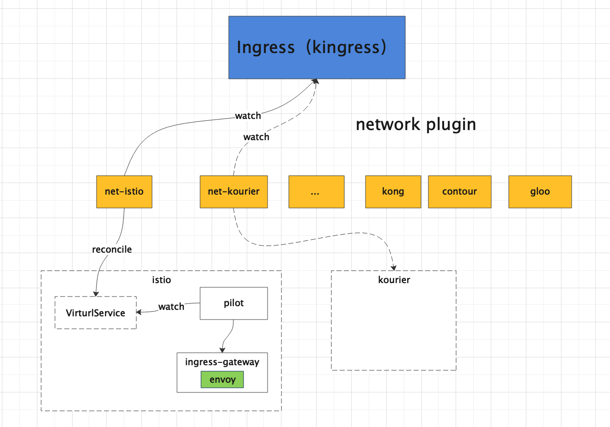

# 如何基于 Knative 开发 自定义controller

## 1. 为什么要开发 自定义 controller？

开源版本的 `Knative` 提供了扩缩容及事件驱动的架构，对于大部分场景的 `Serverless` 已经满足了，不过对于商业版本的 `Serverless` 平台来说，免不了要添加一些增强特性。

通常情况下，`In-Tree` 形式的增强不推荐，而且这种方式也会因开源版本升级带来不小的适配工作量。

`Out-Of-Tree` 形式的 自定义 `controller` 是一种很好特性增强方式，而且社区本身对于周边组件的解耦也是通过 controller 来对接的。比如：

* \*\*\*\*[**net-contour**](https://github.com/knative-sandbox/net-contour) **: 对接  Contour 七层负载的网络插件**
* \*\*\*\*[**net-kourier**](https://github.com/knative-sandbox/net-kourier) **: 对接  Kourier 七层负载的网络插件**
* \*\*\*\*[**net-istio**](https://github.com/knative-sandbox/net-istio) **: 对接  Istio 七层负载的网络插件**

> 上述提到的几个网络插件都是通过 自定义 `Controller` 结合  `Kingress` 这个 `CRD`资源来实现



## 2. How？

对于 有过 `Kubernetes` `operator` 开发经验的同学来说，可能对 [**Kubebuilder**](https://cloudnative.to/kubebuilder/introduction.html) ****更熟悉一些，其实 `Knative` 自定义 控制器的开发更简单，下面一步一步介绍怎么开始

### 2.1  Fork 社区 Template

社区 项目地址在  [https://github.com/knative-sandbox/sample-controller](https://github.com/knative-sandbox/sample-controller)，直接 fork 到个人仓库。

### 2.2 sample-controller介绍

代码下载到本地,目录如下，如下（此处省略掉不重要的文件）：

```bash
sample-controller
├── cmd
│   ├── controller 
│   │   └── main.go # controller 的启动入口文件
│   ├── schema
│   │   └── main.go # 生成 CRD 资源的 工具
│   └── webhook
│       └── main.go # webhook 的入口文件
├── config # controller 和webhook 的部署文件（deploy role clusterrole 等等，此处省略）
│   ├── 300-addressableservice.yaml
│   ├── 300-simpledeployment.yaml
├── example-addressable-service.yaml # CR 资源的示例yaml
├── example-simple-deployment.yaml # CR 资源的示例yaml
├── hack
│   ├── update-codegen.sh # 生成 informer，clientset，injection，lister 等
│   ├── update-deps.sh
│   ├── update-k8s-deps.sh
│   └── verify-codegen.sh
├── pkg
│   ├── apis
│   │   └── samples 
│   │       ├── register.go
│   │       └── v1alpha1 # 此处需编写 CRD 资源的types
│   ├── client # 执行 hack/update-codegen.sh 后自动生成的文件
│   │   ├── clientset
│   │   ├── informers
│   │   ├── injection
│   │   └── listers
│   └── reconciler # 此处是控制器的主要逻辑，示例中实现了两个控制器，每个控制器包含主控制器入口（controller.go） 和对应的 reconcile 逻辑
│       ├── addressableservice
│       │   ├── addressableservice.go
│       │   └── controller.go
│       └── simpledeployment
│           ├── controller.go
│           └── simpledeployment.go

```

**目录介绍：**

* **cmd**: 包含 `controller` 和`webhook` 的入口 `main` 函数,以及生成 crd  的 schema 工具（这也是笔者的社区贡献之一）
* **config**： controller 和webhook 的部署文件（本文只关注 controller）
* **hack**：是 程序自动生成代码的脚本，其中的 `update-codegen.sh` 最常用，是生成 `informer，clientset，injection，lister` 的工具
* **pkg/apis**: 此处是 CRD 定义的 types 文件
* **pkg/client:** 这里是 执行 `hack/update-codegen.sh` 后自动生成的,包含 clienset，informers, injection\(**常用的是其中的 reconfiler 框架，框架中 lister 和 informer 可以从 context 中获取，这也是 injection 的含义**\) ，lister。
* **pkg/reconciler**: 这里是控制器的主要逻辑，包括控制器主入口 `controller.go` 和对应的 `reconciler`逻辑

### 2.3 CRD 资源定义

#### 1. 确定 `GKV`，即资源的 Group、Kind、Version 

此处实例中，有两个 crd 资源，本文主要以 `AddressableService`  为例讲解。

* Group 为`samples.knative.dev` ，
* Kind 为 `AddressableService` \(实例中有两个类型，取一个介绍\)，
* Version 为`v1alpha1`

#### 2.编写 CRD types 文件

**目录**按照 `/pkg/apis/<kind 一般取 groupname 第一个逗号前的单词>/<version>`

  **Group 和 Version及其注册**

```go
# pkg/apis/samples/register.go#20

package samples

const (
	GroupName = "samples.knative.dev"
)
```

在 `addKnownTypes` 中将 `Kind` 注册

```go
# pkg/apis/samples/v1alpha1/register.go#27

// SchemeGroupVersion is group version used to register these objects
var SchemeGroupVersion = schema.GroupVersion{Group: samples.GroupName, Version: "v1alpha1"}

// Adds the list of known types to Scheme.
func addKnownTypes(scheme *runtime.Scheme) error {
	scheme.AddKnownTypes(SchemeGroupVersion,
		&AddressableService{},
		&AddressableServiceList{},
	)
	metav1.AddToGroupVersion(scheme, SchemeGroupVersion)
	return nil
}
```

为 CRD  `types` 编写对应的 `spec` 和 `status`, 注意其中的注解，这是 `hack/update-codegen.sh`  执行生成 `clientset` 和 `reconciler` 的关键

```bash
// +genclient
// +genreconciler
// +k8s:deepcopy-gen:interfaces=k8s.io/apimachinery/pkg/runtime.Object
```

```go
# pkg/apis/samples/v1alpha1/addressable_service_types.go#32
// +genclient
// +genreconciler
// +k8s:deepcopy-gen:interfaces=k8s.io/apimachinery/pkg/runtime.Object
type AddressableService struct {
	metav1.TypeMeta `json:",inline"`
	// +optional
	metav1.ObjectMeta `json:"metadata,omitempty"`

	// Spec holds the desired state of the AddressableService (from the client).
	// +optional
	Spec AddressableServiceSpec `json:"spec,omitempty"`

	// Status communicates the observed state of the AddressableService (from the controller).
	// +optional
	Status AddressableServiceStatus `json:"status,omitempty"`
}

```

#### 3  CRD 资源的 配置

可以看到，对于每个 CRD 资源，除了 xxxtypes.go 外，还有以下几个文件

* xxx\_validation.go:  用于 `webhook` 校验
* _xxx\__lifecycle.go: 用于`status` 状态的设置
* xxx\_defaults.go: 用于 默认值的设置

 可在 xxx\_types 文件中 声明如下，校验是否实现了对应的接口

```go
	// Check that AddressableService can be validated and defaulted.
	_ apis.Validatable   = (*AddressableService)(nil)
	_ apis.Defaultable   = (*AddressableService)(nil)
	_ kmeta.OwnerRefable = (*AddressableService)(nil)
	// Check that the type conforms to the duck Knative Resource shape.
	_ duckv1.KRShaped = (*AddressableService)(nil)
```

#### 4. hack/update-codegen.sh 文件配置

```bash
# 1. knative.dev/sample-controller/pkg/client 表示生成代码的目标位置
# 2. knative.dev/sample-controller/pkg/apis  表示 CRD 资源定义的文件位置
# 3. `samples:v1alpha1` 表示 crd 的kind 版本
# 4. `deepcopy,client,informer,lister` 表示生成对应的方法
${CODEGEN_PKG}/generate-groups.sh "deepcopy,client,informer,lister" \
  knative.dev/sample-controller/pkg/client knative.dev/sample-controller/pkg/apis \
  "samples:v1alpha1" \
  --go-header-file ${REPO_ROOT_DIR}/hack/boilerplate/boilerplate.go.txt

group "Knative Codegen"

# injection 这是生成 reconciler 的关键
# Knative Injection
${KNATIVE_CODEGEN_PKG}/hack/generate-knative.sh "injection" \
  knative.dev/sample-controller/pkg/client knative.dev/sample-controller/pkg/apis \
  "samples:v1alpha1" \
  --go-header-file ${REPO_ROOT_DIR}/hack/boilerplate/boilerplate.go.txt

```

#### 5. 编写完毕，执行 `bash hack/update-codegen.sh`

执行完毕没出错的话，就可以进行下一步编写控制器主逻辑了


如果是 mac 用户，这里一定要升级 bash 版本到 v4\(执行 bash --version 查看\)，不然会出现如下问题，升级方法请自行百度


```bash
bash hack/update-codegen.sh
hack/../vendor/knative.dev/hack/library.sh: line 25: conditional binary operator expected
```

### 2.4 控制器逻辑编写

controller 入口文件

```go
# cmd/controller/main.go

func main() {
	sharedmain.Main("controller",
		addressableservice.NewController,
		simpledeployment.NewController,
	)
}
```

`sharedmain.Main` 函数传入 `controller` 的初始化方法，该方法会返回一个 `controller` 的实现 `controller.impl` ,`impl` 的定义如下，`sharedmain.Main`

```go
# https://github.com/knative/pkg 
# knative.dev/pkg/controller/controller.go#188

type Impl struct {
	// Name is the unique name for this controller workqueue within this process.
	// This is used for surfacing metrics, and per-controller leader election.
	Name string

	// Reconciler is the workhorse of this controller, it is fed the keys
	// from the workqueue to process.  Public for testing.
	Reconciler Reconciler

	// workQueue is a rate-limited two-lane work queue.
	// This is used to queue work to be processed instead of performing it as
	// soon as a change happens. This means we can ensure we only process a
	// fixed amount of resources at a time, and makes it easy to ensure we are
	// never processing the same item simultaneously in two different workers.
	// The slow queue is used for global resync and other background processes
	// which are not required to complete at the highest priority.
	workQueue *twoLaneQueue

	// Sugared logger is easier to use but is not as performant as the
	// raw logger. In performance critical paths, call logger.Desugar()
	// and use the returned raw logger instead. In addition to the
	// performance benefits, raw logger also preserves type-safety at
	// the expense of slightly greater verbosity.
	logger *zap.SugaredLogger

	// StatsReporter is used to send common controller metrics.
	statsReporter StatsReporter
}

# knative.dev/pkg/controller/controller.go#65
type Reconciler interface {
	Reconcile(ctx context.Context, key string) error
}

```

\`\`

